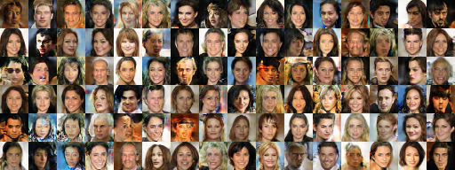
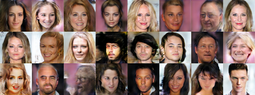
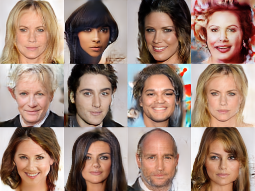
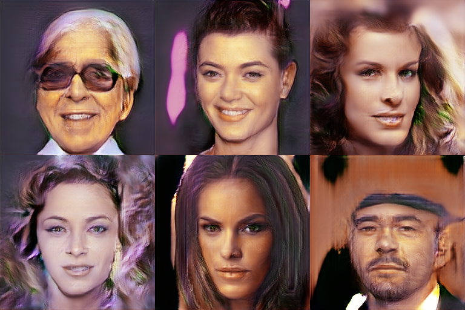
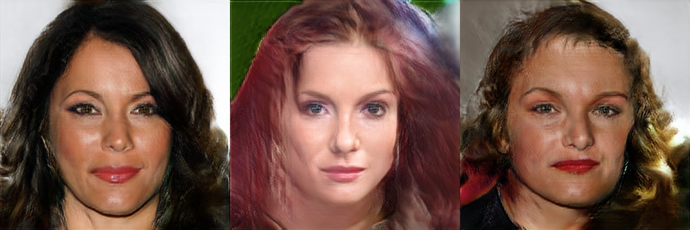

This is a Pytorch implementation of [Progressive GAN](https://arxiv.org/abs/1710.10196).

Borrow code from [PyTorch-progressive_growing_of_gans](https://github.com/github-pengge/PyTorch-progressive_growing_of_gans).

## Requirements

+ Test on Mac, Linux and Windows 7.
+ Python 3 (>=3.5).
+ PyTorch 1.0, python-opencv3.

## Dataset

Download the original CelebA dataset from [here]([http://mmlab.ie.cuhk.edu.hk/projects/CelebA.html](http://mmlab.ie.cuhk.edu.hk/projects/CelebA.html)) and additional deltas files from [here](https://drive.google.com/drive/folders/0B4qLcYyJmiz0TXY1NG02bzZVRGs). Unzip them, then you can generate CelebA-HQ dataset using `dataset_tools.py`:

```shell
python dataset_tools.py create_celeba_hq Celeba-HQ ~/celeba ~/celeba-hq-deltas
```

The CelebA-HQ dataset will be placed in folder `Celeba-HQ`.

To ease image reading, I generate a file list for all training images:

``` shell
python dataset_tools.py generate_filelist Celeba-HQ/ data/
```

The file list will be generated in folder `data`.

## Training

```shell
celeba_hq_dir=Celeba-HQ
g_lr=1e-3
d_lr=1e-3
resolution=4
epochs=40
gan_type=lsgan
norm=pixelnorm
output_act=tanh
start_idx=0  # start epoch
l_gp=1.
device_id=0  # GPU id
batch_size=16

phase=stabilize
# phase=fadein

ckpt_path=ckpt/reso-${resolution}x${resolution}/${phase}_${gan_type}_${norm}_${output_act}
result_path=result/reso-${resolution}x${resolution}/${phase}_${gan_type}_${norm}_${output_act}

python train.py --celeba_hq_dir ${celeba_hq_dir} \
                --g_lr ${g_lr} \
                --d_lr ${d_lr} \
                --batch_size ${batch_size} \
                --epochs ${epochs} \
                --gan_type ${gan_type} \
                --l_gp ${l_gp} \
                --device_id ${device_id} \
                --resolution ${resolution} \
                --norm ${norm} \
                --output_act ${output_act} \
                --start_idx ${start_idx} \
                --phase ${phase} \
                --ckpt_path ${ckpt_path} \
                --result_path ${result_path} 
```

## Result 

Currently, I have only run out some results using LsGAN. For WGAN-GP, the results are very bad and I still don't know why.

<center>
  
  
    
  
  
</center>

